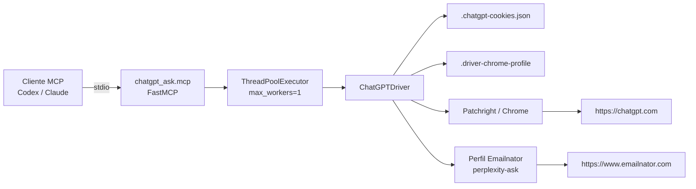

# ChatGPT Ask MCP

MCP local por `stdio` para consultar ChatGPT Web desde una sesión persistente de navegador.

Este proyecto no usa la OpenAI API, no necesita API key y no consume saldo de API. La integración abre/controla ChatGPT Web con Patchright, guarda cookies locales y expone herramientas MCP para que clientes como Codex o Claude puedan llamar a la sesión autenticada.

## Estado Actual

- Ruta del proyecto: `D:\MCP\chatgpt-ask`
- Entrada MCP: `D:\MCP\chatgpt-ask\.venv\Scripts\chatgpt-mcp.exe`
- Driver CLI: `D:\MCP\chatgpt-ask\.venv\Scripts\chatgpt-driver.exe`
- Perfil persistente de Chrome: `D:\MCP\chatgpt-ask\.driver-chrome-profile`
- Cookies de ChatGPT: `D:\MCP\chatgpt-ask\.chatgpt-cookies.json`
- Perfil usado para Emailnator: `D:\MCP\perplexity-ask\.driver-chrome-profile`
- La cuenta temporal ya fue creada una vez y quedó autenticada.
- `chatgpt_deep_research` selecciona la herramienta de ChatGPT, pero la cuenta Free actual puede devolver límite de Deep Research hasta el restablecimiento visible en ChatGPT.

## Qué Hace

- Mantiene una sesión web autenticada de ChatGPT.
- Reutiliza cookies locales si existen.
- Rechaza modo invitado/anónimo para evitar respuestas desde una sesión no autenticada.
- Permite crear una cuenta una sola vez cuando no existe sesión autenticada.
- Expone herramientas MCP separadas para chat normal, búsqueda web, razonamiento y Deep Research.
- Ejecuta un solo browser job a la vez para no pisar una misma sesión web desde varias llamadas MCP concurrentes.

## Qué No Hace

- No usa API key.
- No rota cuentas.
- No crea cuentas automáticamente cuando se alcanza un límite.
- No intenta saltar límites del plan.
- No garantiza estabilidad si ChatGPT cambia selectores, textos o flujo visual de su web.
- No expone generación de imágenes todavía, aunque la opción aparece en la UI.

## Herramientas MCP

| Herramienta | Uso | Modo UI |
| --- | --- | --- |
| `chatgpt_status` | Detecta si la sesión actual está autenticada. | Ninguno |
| `chatgpt_create_account` | Crea una cuenta persistente si no hay sesión autenticada. | Login web + Emailnator |
| `chatgpt_ask` | Envía un prompt normal a ChatGPT. | Auto |
| `chatgpt_search` | Envía un prompt con búsqueda web activada. | `Busca en la web` |
| `chatgpt_reason` | Envía un prompt con razonamiento activado. | `Razonamiento` |
| `chatgpt_deep_research` | Envía un prompt con investigación profunda activada. | `Investigar a fondo` |

## Arquitectura



## Estructura Del Proyecto

```text
D:\MCP\chatgpt-ask
├── chatgpt_ask
│   ├── __init__.py
│   ├── driver.py      # Browser automation, login, cuenta, modos y extracción de respuesta
│   └── mcp.py         # Servidor MCP y registro de herramientas
├── examples
│   └── login.py       # Ejemplo mínimo de login manual
├── tests
├── pyproject.toml     # Dependencias y scripts instalables
├── README.md
├── .chatgpt-cookies.json      # Sesión local, no se debe commitear
└── .driver-chrome-profile     # Perfil local persistente, no se debe commitear
```

## Instalación

PowerShell:

```powershell
cd D:\MCP\chatgpt-ask
python -m venv .venv
.\.venv\Scripts\python.exe -m pip install -U pip
.\.venv\Scripts\python.exe -m pip install -e ".[mcp]"
.\.venv\Scripts\patchright.exe install chromium
```

Validar que los entrypoints existen:

```powershell
Test-Path .\.venv\Scripts\chatgpt-driver.exe
Test-Path .\.venv\Scripts\chatgpt-mcp.exe
```

## Variables De Entorno

| Variable | Valor usado | Descripción |
| --- | --- | --- |
| `CHATGPT_PROFILE_DIR` | `D:\MCP\chatgpt-ask\.driver-chrome-profile` | Perfil persistente usado por ChatGPT. |
| `CHATGPT_COOKIES_FILE` | `D:\MCP\chatgpt-ask\.chatgpt-cookies.json` | Archivo local donde se guardan cookies de ChatGPT. |
| `CHATGPT_EMAILNATOR_PROFILE_DIR` | `D:\MCP\perplexity-ask\.driver-chrome-profile` | Perfil de navegador que ya pasa Emailnator. |
| `CHATGPT_HEADLESS` | vacío / `1` | Si es `1`, `true` o `yes`, intenta ejecutar el navegador en headless. |
| `CHATGPT_TIMEOUT_MS` | `120000` por defecto | Timeout base del driver. |
| `MCP_TRANSPORT` | `stdio` por defecto | Transporte MCP. También acepta `http`. |
| `MCP_HOST` | `127.0.0.1` | Host si se usa transporte HTTP. |
| `MCP_PORT` | `8000` | Puerto si se usa transporte HTTP. |

## Login Manual

Usar esto si quieres iniciar sesión con una cuenta existente.

```powershell
cd D:\MCP\chatgpt-ask
.\.venv\Scripts\chatgpt-driver.exe --login
```

El navegador abre `https://chatgpt.com/`. Completa el login manualmente. Al terminar, el driver guarda cookies en:

```text
D:\MCP\chatgpt-ask\.chatgpt-cookies.json
```

Comprobar sesión:

```powershell
.\.venv\Scripts\chatgpt-driver.exe --status
```

Respuesta esperada cuando está bien:

```json
{
  "authenticated": true,
  "login_ui": false,
  "mode": "authenticated"
}
```

## Bootstrap De Cuenta Única

Usar esto solo si no hay una sesión autenticada.

```powershell
cd D:\MCP\chatgpt-ask
$env:CHATGPT_EMAILNATOR_PROFILE_DIR = "D:\MCP\perplexity-ask\.driver-chrome-profile"
.\.venv\Scripts\chatgpt-driver.exe --create-account
```

Flujo interno:

1. Abre Emailnator con el perfil configurado.
2. Genera un correo `googlemail`.
3. Abre ChatGPT.
4. Envía el correo al formulario de login/registro.
5. Espera el correo de verificación.
6. Extrae el código.
7. Completa el flujo de verificación.
8. Rellena pasos opcionales de perfil si aparecen.
9. Cierra onboarding si aparece.
10. Guarda cookies de ChatGPT.

Importante: esta acción crea una cuenta persistente y termina. No hay rotación ni creación automática posterior.

## Uso CLI

Chat normal:

```powershell
.\.venv\Scripts\chatgpt-driver.exe --ask "Reply with exactly: ok"
```

Búsqueda web:

```powershell
.\.venv\Scripts\chatgpt-driver.exe --mode search --ask "Busca en la web y responde breve: estado actual de Python 3.13"
```

Razonamiento:

```powershell
.\.venv\Scripts\chatgpt-driver.exe --mode reason --ask "Razona paso a paso y responde solo el resultado: 17 * 19"
```

Deep Research:

```powershell
.\.venv\Scripts\chatgpt-driver.exe --mode deep_research --ask "Investiga a fondo y resume las diferencias entre MCP stdio y HTTP"
```

El modo Deep Research puede responder con un límite del plan si la cuenta actual ya consumió esa capacidad.

## Configuración En Codex

Archivo:

```text
C:\Users\henry\.codex\config.toml
```

Bloque:

```toml
[mcp_servers.chatgpt]
command = 'D:\MCP\chatgpt-ask\.venv\Scripts\chatgpt-mcp.exe'
enabled = true

[mcp_servers.chatgpt.env]
CHATGPT_COOKIES_FILE = 'D:\MCP\chatgpt-ask\.chatgpt-cookies.json'
CHATGPT_PROFILE_DIR = 'D:\MCP\chatgpt-ask\.driver-chrome-profile'
CHATGPT_EMAILNATOR_PROFILE_DIR = 'D:\MCP\perplexity-ask\.driver-chrome-profile'
```

Después de cambiar este archivo, reinicia Codex para que cargue el MCP nuevo.

## Configuración En Claude

Archivo global usado en este entorno:

```text
C:\Users\henry\.claude.json
```

Servidor MCP:

```json
{
  "chatgpt": {
    "type": "stdio",
    "command": "D:\\MCP\\chatgpt-ask\\.venv\\Scripts\\chatgpt-mcp.exe",
    "args": [],
    "env": {
      "CHATGPT_COOKIES_FILE": "D:\\MCP\\chatgpt-ask\\.chatgpt-cookies.json",
      "CHATGPT_PROFILE_DIR": "D:\\MCP\\chatgpt-ask\\.driver-chrome-profile",
      "CHATGPT_EMAILNATOR_PROFILE_DIR": "D:\\MCP\\perplexity-ask\\.driver-chrome-profile"
    }
  }
}
```

Después de editar la config, reinicia Claude o recarga MCP según el cliente.

## Flujo De Una Llamada MCP

1. El cliente llama una tool MCP.
2. `chatgpt_ask/mcp.py` recibe la llamada por `stdio`.
3. La llamada se mete en `ThreadPoolExecutor(max_workers=1)`.
4. `ChatGPTDriver` abre el perfil persistente.
5. Se cargan cookies desde `.chatgpt-cookies.json`.
6. El driver abre `https://chatgpt.com/`.
7. Verifica que no esté en modo invitado ni en pantalla de login.
8. Selecciona la herramienta visual si el modo lo requiere.
9. Escribe el prompt en el composer.
10. Espera a que aparezca nueva respuesta.
11. Extrae el texto visible más reciente.
12. Devuelve el resultado por MCP.

## Verificación

Compilar módulos Python:

```powershell
cd D:\MCP\chatgpt-ask
.\.venv\Scripts\python.exe -m compileall chatgpt_ask examples -q
```

Ver estado:

```powershell
.\.venv\Scripts\chatgpt-driver.exe --status
```

Probar llamada normal:

```powershell
.\.venv\Scripts\chatgpt-driver.exe --ask "Reply with exactly: account-ok"
```

Probar modos:

```powershell
.\.venv\Scripts\chatgpt-driver.exe --mode search --ask "Reply with exactly: search-ok"
.\.venv\Scripts\chatgpt-driver.exe --mode reason --ask "Reply with exactly: reason-ok"
.\.venv\Scripts\chatgpt-driver.exe --mode deep_research --ask "Reply with exactly: deep-ok"
```

Deep Research puede devolver un mensaje de límite del plan Free en vez de `deep-ok`.

## Troubleshooting

### `LOGIN_REQUIRED`

El MCP detectó modo invitado, login visible o falta de cookie autenticada.

Solución:

```powershell
.\.venv\Scripts\chatgpt-driver.exe --login
.\.venv\Scripts\chatgpt-driver.exe --status
```

### `CHATGPT_WEB_ERROR`

El driver llegó a ChatGPT pero falló un selector, timeout, envío o extracción.

Pasos:

```powershell
$env:CHATGPT_HEADLESS = ""
.\.venv\Scripts\chatgpt-driver.exe --ask "Reply with exactly: debug-ok"
```

Con navegador visible se puede ver si cambió la UI, si apareció onboarding o si la sesión expiró.

### Deep Research Devuelve Límite

Eso no es fallo del MCP si la UI de ChatGPT muestra el límite. La herramienta sí selecciona `Investigar a fondo`, pero el plan Free puede bloquear la ejecución hasta el reset de cuota.

### Emailnator Falla

Verifica que `CHATGPT_EMAILNATOR_PROFILE_DIR` apunte al perfil que ya funciona:

```powershell
$env:CHATGPT_EMAILNATOR_PROFILE_DIR = "D:\MCP\perplexity-ask\.driver-chrome-profile"
.\.venv\Scripts\chatgpt-driver.exe --create-account
```

Si Emailnator cambia su flujo o bloquea el perfil, el bootstrap puede fallar aunque el MCP normal siga funcionando con cookies existentes.

### `chatgpt-mcp.exe` Bloqueado Al Reinstalar

Si `pip install -e ".[mcp]"` falla porque el `.exe` está en uso, cierra Codex/Claude o mata el proceso MCP anterior.

PowerShell:

```powershell
Get-Process chatgpt-mcp -ErrorAction SilentlyContinue | Stop-Process -Force
.\.venv\Scripts\python.exe -m pip install -e ".[mcp]"
```

### Mojibake En Consola

Si PowerShell muestra caracteres raros en textos con acentos, cambia la consola a UTF-8:

```powershell
chcp 65001
$OutputEncoding = [Console]::OutputEncoding = [Text.UTF8Encoding]::new()
```

## Desarrollo

Entrypoints:

- `chatgpt_ask.driver:main` instala `chatgpt-driver`.
- `chatgpt_ask.mcp:main` instala `chatgpt-mcp`.

Funciones principales:

- `ChatGPTDriver.login()` abre ChatGPT para login manual y guarda cookies.
- `ChatGPTDriver.create_account_once()` ejecuta el bootstrap con Emailnator.
- `ChatGPTDriver.status()` detecta sesión autenticada.
- `ChatGPTDriver.ask(prompt, mode="auto")` envía prompts desde la UI.
- `ChatGPTDriver._select_mode()` traduce `search`, `reason` y `deep_research` a labels de la UI.
- `ChatGPTDriver._latest_chat_result()` extrae la respuesta visible más reciente.
- `chatgpt_ask.mcp.main()` registra tools MCP.

Para agregar una herramienta nueva:

1. Implementa el modo en `ChatGPTDriver._select_mode()` o una función dedicada.
2. Agrega una función pública en `chatgpt_ask/mcp.py`.
3. Registra la tool en `main()`.
4. Reinstala en editable:

```powershell
.\.venv\Scripts\python.exe -m pip install -e ".[mcp]"
```

5. Reinicia el cliente MCP.
6. Verifica con una llamada real.

## Archivos Sensibles

No commitear:

- `.chatgpt-cookies.json`
- `.driver-chrome-profile/`
- `.venv/`
- `chatgpt_ask.egg-info/`
- perfiles temporales `.inspect-*`

Estos archivos contienen sesión local, cache de navegador o artefactos de instalación.

## Limitaciones Técnicas

- La integración depende de la UI web de ChatGPT, por lo tanto puede romperse con cambios visuales.
- Las respuestas se extraen desde el DOM visible, no desde una API estable.
- El modo Deep Research puede tardar más y además puede estar limitado por plan.
- El driver está diseñado para una sesión local, no para concurrencia alta.
- El MCP serializa llamadas con un solo worker para proteger el perfil persistente.
- Generación de imágenes no está expuesta todavía porque requiere definir salida de archivo, descarga o extracción de asset.

## Comandos De Referencia Rápida

```powershell
cd D:\MCP\chatgpt-ask

# instalar
.\.venv\Scripts\python.exe -m pip install -e ".[mcp]"
.\.venv\Scripts\patchright.exe install chromium

# sesión
.\.venv\Scripts\chatgpt-driver.exe --status
.\.venv\Scripts\chatgpt-driver.exe --login
.\.venv\Scripts\chatgpt-driver.exe --create-account

# prompts
.\.venv\Scripts\chatgpt-driver.exe --ask "Reply with exactly: ok"
.\.venv\Scripts\chatgpt-driver.exe --mode search --ask "Reply with exactly: search-ok"
.\.venv\Scripts\chatgpt-driver.exe --mode reason --ask "Reply with exactly: reason-ok"
.\.venv\Scripts\chatgpt-driver.exe --mode deep_research --ask "Reply with exactly: deep-ok"

# verificar sintaxis
.\.venv\Scripts\python.exe -m compileall chatgpt_ask examples -q
```
