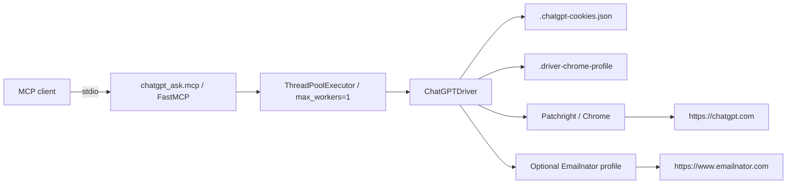

# ChatGPT Ask MCP

Local MCP server for asking ChatGPT through an authenticated ChatGPT Web browser session.

This project does not use the OpenAI API and does not require an API key. It uses Patchright/Chrome automation, a persistent local browser profile, and a local cookie file to expose ChatGPT Web as MCP tools over `stdio`.

## Features

- MCP server over `stdio`.
- Persistent local browser profile.
- Saved ChatGPT cookies in a local file.
- Manual login flow for an existing ChatGPT account.
- Optional one-time account bootstrap flow using an Emailnator browser profile.
- Separate MCP tools for normal chat, web search, reasoning, and Deep Research.
- Serialized browser execution so one profile is not used by multiple concurrent calls.

## What This Is Not

- It is not an OpenAI API wrapper.
- It does not use API keys.
- It does not rotate accounts.
- It does not create new accounts automatically when limits are reached.
- It does not bypass plan limits.
- It depends on the ChatGPT Web UI, so selectors can break if the web app changes.

## MCP Tools

| Tool | Purpose | ChatGPT UI mode |
| --- | --- | --- |
| `chatgpt_status` | Check whether the saved web session is authenticated. | None |
| `chatgpt_create_account` | Create one persistent account when no authenticated session exists. | Login/signup flow |
| `chatgpt_ask` | Send a normal prompt. | Auto |
| `chatgpt_search` | Send a prompt with web search selected. | Search the web |
| `chatgpt_reason` | Send a prompt with reasoning selected. | Reasoning |
| `chatgpt_deep_research` | Send a prompt with Deep Research selected. | Deep Research |

## Architecture



## Project Layout

```text
chatgpt-ask/
|-- chatgpt_ask/
|   |-- __init__.py
|   |-- driver.py      # Browser automation, login, account bootstrap, modes, response extraction
|   `-- mcp.py         # MCP server and tool registration
|-- examples/
|   `-- login.py       # Minimal manual-login example
|-- pyproject.toml
|-- README.md
|-- LICENSE
|-- .gitignore
`-- .mcp.example.json  # Example MCP config with placeholders
```

Local runtime files are intentionally ignored:

- `.venv/`
- `.chatgpt-cookies.json`
- `.driver-chrome-profile/`
- `.emailnator-chrome-profile/`
- `.mcp.json`

## Install

From the repository root:

```powershell
python -m venv .venv
.\.venv\Scripts\python.exe -m pip install -U pip
.\.venv\Scripts\python.exe -m pip install -e ".[mcp]"
.\.venv\Scripts\patchright.exe install chromium
```

Verify entrypoints:

```powershell
Test-Path .\.venv\Scripts\chatgpt-driver.exe
Test-Path .\.venv\Scripts\chatgpt-mcp.exe
```

## Environment Variables

| Variable | Default | Description |
| --- | --- | --- |
| `CHATGPT_PROFILE_DIR` | `./.driver-chrome-profile` | Persistent Chrome profile used for ChatGPT. |
| `CHATGPT_COOKIES_FILE` | `./.chatgpt-cookies.json` | Local file where ChatGPT cookies are saved. |
| `CHATGPT_EMAILNATOR_PROFILE_DIR` | `../perplexity-ask/.driver-chrome-profile`, then `./.emailnator-chrome-profile` | Optional profile used for Emailnator during account bootstrap. |
| `CHATGPT_HEADLESS` | unset | Set to `1`, `true`, or `yes` to try running the browser headless. |
| `CHATGPT_TIMEOUT_MS` | `120000` | Base timeout for driver operations. |
| `MCP_TRANSPORT` | `stdio` | Only `stdio` is supported. HTTP transport is intentionally disabled. |

## Manual Login

Use this when you want to authenticate with an existing ChatGPT account:

```powershell
.\.venv\Scripts\chatgpt-driver.exe --login
```

Complete login in the opened browser. The driver saves cookies to the configured `CHATGPT_COOKIES_FILE`, or to `./.chatgpt-cookies.json` by default.

Check the session:

```powershell
.\.venv\Scripts\chatgpt-driver.exe --status
```

Expected authenticated shape:

```json
{
  "authenticated": true,
  "login_ui": false,
  "mode": "authenticated"
}
```

## One-Time Account Bootstrap

Use this only when no authenticated ChatGPT session exists:

```powershell
$env:CHATGPT_EMAILNATOR_PROFILE_DIR = "<path-to-emailnator-browser-profile>"
.\.venv\Scripts\chatgpt-driver.exe --create-account
```

Internal flow:

1. Opens Emailnator using the configured browser profile.
2. Generates a `googlemail` address.
3. Opens ChatGPT.
4. Submits the email to ChatGPT login/signup.
5. Waits for the verification email.
6. Extracts the verification code.
7. Completes verification.
8. Completes optional profile steps if shown.
9. Dismisses onboarding if shown.
10. Saves ChatGPT cookies locally.

This creates one persistent account and stops. It does not rotate accounts or create another account when ChatGPT later reports a limit.

## CLI Usage

Normal chat:

```powershell
.\.venv\Scripts\chatgpt-driver.exe --ask "Reply with exactly: ok"
```

Web search:

```powershell
.\.venv\Scripts\chatgpt-driver.exe --mode search --ask "Search the web and answer briefly: latest Python release"
```

Reasoning:

```powershell
.\.venv\Scripts\chatgpt-driver.exe --mode reason --ask "Solve: 17 * 19"
```

Deep Research:

```powershell
.\.venv\Scripts\chatgpt-driver.exe --mode deep_research --ask "Research MCP stdio versus HTTP and summarize"
```

Deep Research may return a visible plan-limit message when the current ChatGPT account has exhausted that quota.

## MCP Configuration

Use absolute paths in real MCP client configuration. Replace placeholders with your local checkout path.

### Codex `config.toml`

```toml
[mcp_servers.chatgpt]
command = '<repo-root>\.venv\Scripts\chatgpt-mcp.exe'
enabled = true

[mcp_servers.chatgpt.env]
CHATGPT_COOKIES_FILE = '<repo-root>\.chatgpt-cookies.json'
CHATGPT_PROFILE_DIR = '<repo-root>\.driver-chrome-profile'
CHATGPT_EMAILNATOR_PROFILE_DIR = '<optional-emailnator-profile-dir>'
```

### Claude `settings.json`

```json
{
  "mcpServers": {
    "chatgpt": {
      "type": "stdio",
      "command": "<repo-root>\\.venv\\Scripts\\chatgpt-mcp.exe",
      "args": [],
      "env": {
        "CHATGPT_COOKIES_FILE": "<repo-root>\\.chatgpt-cookies.json",
        "CHATGPT_PROFILE_DIR": "<repo-root>\\.driver-chrome-profile",
        "CHATGPT_EMAILNATOR_PROFILE_DIR": "<optional-emailnator-profile-dir>"
      }
    }
  }
}
```

The repository also includes `.mcp.example.json` as a template. Copy it to `.mcp.json` locally if your MCP client supports project-local MCP config files.

## MCP Call Flow

1. MCP client calls a tool.
2. `chatgpt_ask/mcp.py` receives the request over `stdio`.
3. A single-worker executor serializes browser operations.
4. `ChatGPTDriver` opens the persistent browser profile.
5. Cookies are loaded from the configured cookie file.
6. The driver opens `https://chatgpt.com/`.
7. It rejects guest or logged-out mode.
8. It selects the requested ChatGPT UI mode if needed.
9. It sends the prompt through the composer.
10. It waits for a stable assistant response.
11. It returns the latest visible assistant text.

## Verification

Compile Python files:

```powershell
.\.venv\Scripts\python.exe -m compileall chatgpt_ask examples -q
```

Check session:

```powershell
.\.venv\Scripts\chatgpt-driver.exe --status
```

Test one prompt:

```powershell
.\.venv\Scripts\chatgpt-driver.exe --ask "Reply with exactly: account-ok"
```

Test modes:

```powershell
.\.venv\Scripts\chatgpt-driver.exe --mode search --ask "Reply with exactly: search-ok"
.\.venv\Scripts\chatgpt-driver.exe --mode reason --ask "Reply with exactly: reason-ok"
.\.venv\Scripts\chatgpt-driver.exe --mode deep_research --ask "Reply with exactly: deep-ok"
```

## Troubleshooting

### `LOGIN_REQUIRED`

The MCP detected guest mode, login UI, or no authenticated session cookie.

Run:

```powershell
.\.venv\Scripts\chatgpt-driver.exe --login
.\.venv\Scripts\chatgpt-driver.exe --status
```

### `CHATGPT_WEB_ERROR`

The driver reached ChatGPT but failed on selectors, timeout, send, or response extraction.

Run with a visible browser:

```powershell
$env:CHATGPT_HEADLESS = ""
.\.venv\Scripts\chatgpt-driver.exe --ask "Reply with exactly: debug-ok"
```

### Deep Research Returns A Limit Message

That is not necessarily an MCP failure. The tool selects Deep Research, but ChatGPT can block execution when the account quota is exhausted.

### Emailnator Fails

Set `CHATGPT_EMAILNATOR_PROFILE_DIR` to a browser profile that can already open Emailnator:

```powershell
$env:CHATGPT_EMAILNATOR_PROFILE_DIR = "<path-to-emailnator-browser-profile>"
.\.venv\Scripts\chatgpt-driver.exe --create-account
```

### `chatgpt-mcp.exe` Is Locked During Reinstall

Close the MCP client or stop the old process:

```powershell
Get-Process chatgpt-mcp -ErrorAction SilentlyContinue | Stop-Process -Force
.\.venv\Scripts\python.exe -m pip install -e ".[mcp]"
```

## Development Notes

Entrypoints:

- `chatgpt_ask.driver:main` installs `chatgpt-driver`.
- `chatgpt_ask.mcp:main` installs `chatgpt-mcp`.

Important functions:

- `ChatGPTDriver.login()` opens ChatGPT for manual login and saves cookies.
- `ChatGPTDriver.create_account_once()` runs the optional Emailnator bootstrap.
- `ChatGPTDriver.status()` detects authenticated state.
- `ChatGPTDriver.ask(prompt, mode="auto")` sends prompts through the UI.
- `ChatGPTDriver._select_mode()` maps `search`, `reason`, and `deep_research` to UI labels.
- `ChatGPTDriver._latest_chat_result()` extracts the latest visible response.
- `chatgpt_ask.mcp.main()` registers MCP tools.

To add a new tool:

1. Add a driver method or a mode in `ChatGPTDriver._select_mode()`.
2. Add a public tool function in `chatgpt_ask/mcp.py`.
3. Register it in `main()`.
4. Reinstall editable package:

```powershell
.\.venv\Scripts\python.exe -m pip install -e ".[mcp]"
```

5. Restart the MCP client.
6. Verify with a real call.

## Security Notes

Do not commit:

- `.chatgpt-cookies.json`
- `.driver-chrome-profile/`
- `.emailnator-chrome-profile/`
- `.venv/`
- `.mcp.json`

Cookie and profile files contain local session material. On shared machines, restrict filesystem permissions so only the current user, Administrators, and SYSTEM can read or modify them.

## License

MIT. See [LICENSE](LICENSE).
